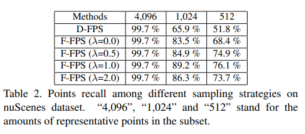

## 1. 引言
- 在 point-based 的方法中，FP 层（Feature Propagation）耗费了将近一半的推断时间。但是，FP 层又是不能丢弃的。
- 现有 SA 层（Set Abstraction）的采样方法是 FPS （Furthest Point Sampling），主要标准是 3D 空间位置的欧式距离（D-FPS）。有些目标表面的点很少，因此这种采样会丢失其很多的信息。
- 如果没有上采样操作，仅仅基于降采样后的点进行目标预测，检测的性能会下降很多。因此在 FP 层中必须进行上采样。**为了加快推断的速度，本文提出，基于特征距离的采样方法，叫做 F-FPS。** 它可以为不同的目标采样更好的点。文中最终的采样方法是 F-FPS 和 D-FPS 的融合。
- 在 SA 层之后，本文提出一个 box 预测网络，其包含一个 CG 层（candidate generation）。
- 实验表明，本文的方法超过所有 voxel-based 的单阶段方法，并且与两阶段的方法性能差不多，但是更快的推断速度。

## 2. 方法介绍
### 2.1 Fusion Sampling
Point-based 的方法主要包含两个步骤：1）SA 层（Set Abstraction），将数据进行下采样，以提高运算效率和增大感受域。FP 层（Feature Propagation）将特征传递给下采样过程中丢弃的点，使得所有点的特征都能得到更新。2）基于得到的特征，一个 refinement 模块对 RPN 提出的 proposals 进行修复，以得到更准确的结果。SA 层对提取点的特征是不可或缺的，**FP 层和 refinement 模块限制了模型的性能，可以被进一步改进。**

SA 层使用 D-FPS 对点云数据进行下采样。如果没有 FP 层，box 预测网络必须基于这些下采样后的点进行预测。但是，D-FPS 方法只考虑了点直接的空间距离，下采样后的点很大比例是背景点，而对于表面点较少的目标，丢失了很多的信息。下采样后点的个数是固定的， $N_m$，对于较远（小）的目标，他们表面的点会变得更少，甚至没有。这种问题在某些复杂的数据集比如 nuScenes 上更加严重。

<!-- {:class="img-responsive"} -->

为了量化，文中定义一个指标，召回率 —— $\frac{下采样后的目标数量}{下采样前的目标数量}$. 上图是 nuScenes 的下采样召回率情况。使用 D-FPS 的方法，当下采样的点很少是，大概只有一半的召回率。为了缓解召回率低的问题，现在的方法都是使用 FP 层去上采样，召回下采样过程中被丢弃的点，但是这种方法十分耗时。

**Feature-FPS** 
为了保留 positive points （前景目标的内部点），减少没用的 negative points （背景的内部点），在采样的过程中，不仅要考虑空间距离，而且考虑点的语义（特征）距离。神经网络可以挖掘点的语义信息，因此在 FPS 算法中使用特征距离标准，可以有效地丢弃同样语义的背景点。而前景点直接的语义距离差异性大，因此即使较远（小）目标的内部点仍能有效地保留下来。

但是，如果以语义（特征）距离作为唯一的标准，一个目标可能会保留很多的点，比如汽车的窗户和轮胎的语义距离就不一样，窗户或者轮胎的任一点集合就足够用来做回归预测。（解释得有点牵强？）如果仅仅使用语义距离，许多背景点会被丢弃掉，因此 negative point 不能找到足够多的邻近点，感受域较小。因此 positive point 和 negative point 很难被区分。因此，尽管 F-FPS 会带来检测效果的提升，但是会降低分类的性能。

因此，在 SA 层，我们不仅要采样足够多的 positive points，并且也要采样足够的 negative points。所以，文中同时采用 D-FPS 和 F-FPS。具体地，D-FPS 和 F-FPS 分别采样 $\frac{N_m}{2}$ 个点。

为了减少冗余，同时增加多样性，文中 FPS 使用空间距离和语义（特征）距离两种标准，定义如下：

$$
C(A,B) =\lambda L_d(A,B)+L_f(A,B), 
$$
$L_d, L_f$ 都是 $L_2$ 度量。

### 2.2 Box Prediction Network

**Candidate Generation Layer**
经过一系列 F-FPS 和 D-FPS，可以得到点云子集的特征。在以往的模型中，在进行预测之前，一个 SA 层被用来提取特征，一般有如下步骤：中心点的选择，邻近点的提取，以及生成新的点特征。

本文的 SA 方法如下：
- 因为 D-FPS 得到的点中有很多 negative points，negative points 在 bounding box 的预测中没什么作用。因此，只考虑将 F-FPS 采样得到的点作为初始化点。将这些初始化点进行偏移（和 VoteNet 相似），得到目标的中心点（如上图）。
- 从 D-FPS 和 F-FPS 中采样的点中寻找中心点的邻近点（预先设定距离阈值）。
- 根据这些邻近点的特征来更新中心点的特征。这些点的特征接下来被用来做回归和分类。

**2.3 Anchor-free Regression Head**
利用联合 D-FPS 和 F-FPS 采样的方法，以及 CG 层，文中的模型可以去掉耗时的 FP 层和 refinement 模块。本文选择了 anchor-free 的方法做目标的回归。预测的 bounding box 参数包括：
- 中心点的位置偏移值，$(d_x, d_y, d_z)$
- bounding box 的长宽高，$(d_l, d_w, d_h)$ 
- 旋转角度，$\theta$，将旋转角度分成 12 个类别，回归角度的类别和角度的残差。

**3D Center-ness Assignment Strategy**
对于每一个 candidate point，我们需要判定其是不是目标的中心点，分为两步：
- 我们首先判定其是不是在一个目标的内部，$l_{mask}$，是一个二元值（0或者1）.
- 找到这个中心点到目标前后左右上下 6 个点的距离，$f,b,l,r,t,d$。计算 
  $$
  l_{ctrness} = \sqrt[3]{\frac{min(f,b)}{max(f,b)}\times \frac{min(r, l)}{max(r,l)}\times \frac{min(t,d)}{max(t,d)}} \\
  l_{center} = l_{mask} \times l_{ctrness}
  $$
### 2.3 Loss Function
具体参考 [CVPR 论文](https://openaccess.thecvf.com/content_CVPR_2020/papers/Yang_3DSSD_Point-Based_3D_Single_Stage_Object_Detector_CVPR_2020_paper.pdf)。

## 参考文献
https://openaccess.thecvf.com/content_CVPR_2020/papers/Yang_3DSSD_Point-Based_3D_Single_Stage_Object_Detector_CVPR_2020_paper.pdf

