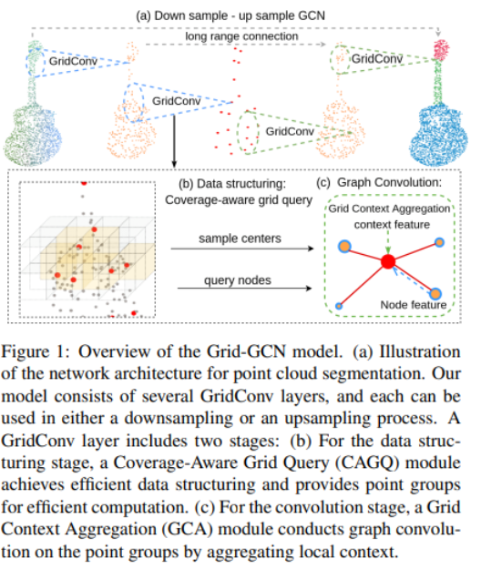
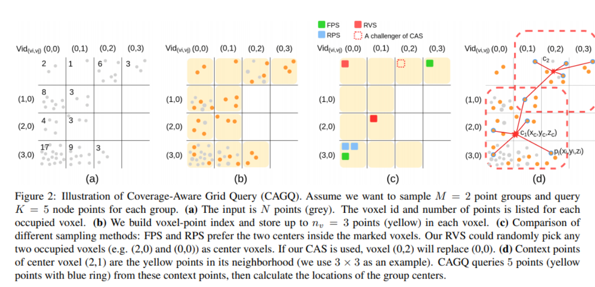
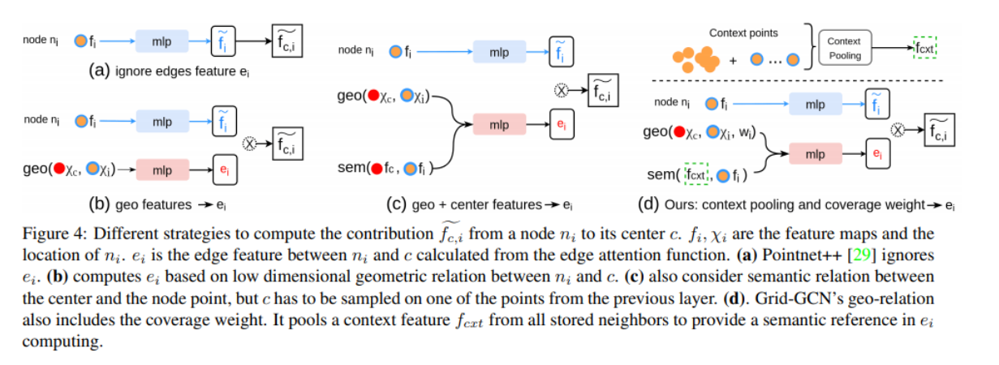

## 1. 引言

Point-based 或者 GCN-based 的方法通常需要使用 FPS 和 k-NN，数据结构化开销较大。[Liu et al.](https://arxiv.org/abs/1907.03739) 研究表明，数据的结构化的开销占总共开销高达 88%。这篇文章提出 Grid-GCN，结合 volumetric 模型和 point-based 模型的优势结合起来，使数据结构化和运算代价都比较低。

如图，模型由若干的 GridConv 操作构成，**每个 GridConv 包含两个步骤**：1）数据结构化阶段，采样中心点，并且查询邻近点；2）卷积操作：构建一个局部的图，并且以邻近点的特征更新中心点的特征。

为了有效的数据结构化，设计了 **Coverage-Aware Grid Query （CAGQ）** 模块， 1）它加速了中心点的采样和邻近点的查询；2）采样的点具有更好的覆盖性。通过体素化，获得了数据结构化的高效；只在 active 的点上运算，也获得了运算的高效性。**Grid Context Aggregation （GCA）** 挖掘点直接的关系，在引入额外开销的基础上，考虑边的信息。

## 2. 方法

Grid-GCN 是基于多个 Grid-Conv 层，将 $N$ 个点转化称 $M$ 个点。对于下采样操作， $N<M$；对于上采样操作， $N>M$。 Grid-Conv 有两个主要模块：
- **CAGQ** 模块从 $N$ 个点中采样得到 $M$ 个点组，每组有 $K$ 个点和一个中心点。
- **GCA** 模块为每组构建一个局部的图，并且将信息聚合到每组的中心点上。

### 2.1  Coverage-Aware Grid Query (CAGQ)
点云的数据结构化主要包括两个部分，1）中心点的采样， 2）和邻近点的查询。为了对点云数据进行体素化，我们首先设置 voxel size，然后将每个点映射到一个体素的 index 下，$Vid(u,v,w)=floor(\frac{x}{v_x}, \frac{y}{v_y}, \frac{z}{v_z})$。在每个体素中，我们最多只存储 $n_v$ 个点。

让 $O_v$ 表示非空的体素，我们从中采样 $M$ 个中心体素 $O_c\subset O_v$。对于每个体素 $v_i$ 我们定义其邻近点为 $\pi(v_i)$ （如上图所示，红色框内的点就是中心点的邻近点）。CAGQ 从邻近点中选取 k 个点组成一组，以组内点的中心作为中心点。接下来有两个问题需要解决，1）我们如何采样中心体素 $O_c\subset O_v$；2）如何从邻近点中选取 $K$ 个点。对于第一个问题，有两种方法：
- Random Voxel Sampling （RVS），每个体素都有同样的概率被选择。
- Coverage-Aware Sampling （CAS），其目标是选择的体素可以覆盖更大的空间。寻找最优解需要迭代所有的组合。因此，文中使用一个贪心算法去接近最优解。首先从 $O_v$ 中随机采样 $M$ 个体素作为在位者 incumbents。从没有被选择的体素中，依次选择一个作为挑战者 challenger $V_C$，随机选择一个在位者 $V_I$，如果挑战者的覆盖性更好，就将在位者替换成挑战者。覆盖性的比较如下：

$$
\delta(x) = \begin{cases}
    &1, &if\ x=0\\
    &0, &otherwise
\end{cases}\\
$$

$$
H_{add} = \sum_{v\in\pi(V_c)} \delta(C_V) -\beta\cdot \frac{C_v}{\lambda}
$$

$$
H_{rmv} = \sum_{v\in\pi(V_I)} \delta(C_V-1)
$$

这里 $\lambda$ 表示一个 voxel 的邻近点的数目，$C_V$ 表示覆盖 $V$ 的在位者的数目。

### 2.2 Grid Context Aggregation （CAG）
对于每一个 CAGQ 提供的点组，我们使用 GCA 将点组的特征聚合到中心点。首先对每个局部点组构建一个局部图，$G(V,E)，V$ 包含中心点和邻近点， 然后将每个点与中心点相连，\(\hat{f}_c\) 表示更新后中心点的特征，\(\hat{f}_{c,i}\) 表示第 $i$ 个点的贡献特征， $X_i, f_i$ 分别表示第 $i$ 点的 $xyz$ 坐标和特征。 $e$ 是边的注意力函数，$M$ 是一个 MLP。 

$$
\hat{f}{c,i}=e(X_i, f_i) * M(f_i)\\
\hat{f}_c = A(\{\hat{f}_{c,i}\}, i\in 1,...,K)
$$

上图表示不同的特征聚合方法。

**Coverage Weight** 在计算邻近点的贡献时，考虑每个点的覆盖率。覆盖率大的点应该有更大的权重。
**Grid Context Pooling** 在计算邻近点的贡献时，以往的方法主要时考虑邻近点特征与中心点的关系。但是，中心点可能不能很好地表示整个组的特征，因此使用 Grid Context Pooling 的操作，从组内所有的点中提取背景特征 $f_{cxt}$。其好处是：
- $f_{cxt}$ 建模了一个虚拟的组内中心点，可以更好地表达每个点与此组的关系。
- $f_{cxt}$ 可以覆盖更多的点。
- 没有额外的计算开销，pooling 操作开销很低。

$$
e=mlp(mlp_{geo}(X_c, X_i, w_i), mlp_{sem}(f_{cxt}, f_i))
$$

## 参考文献
https://arxiv.org/pdf/1912.02984.pdf